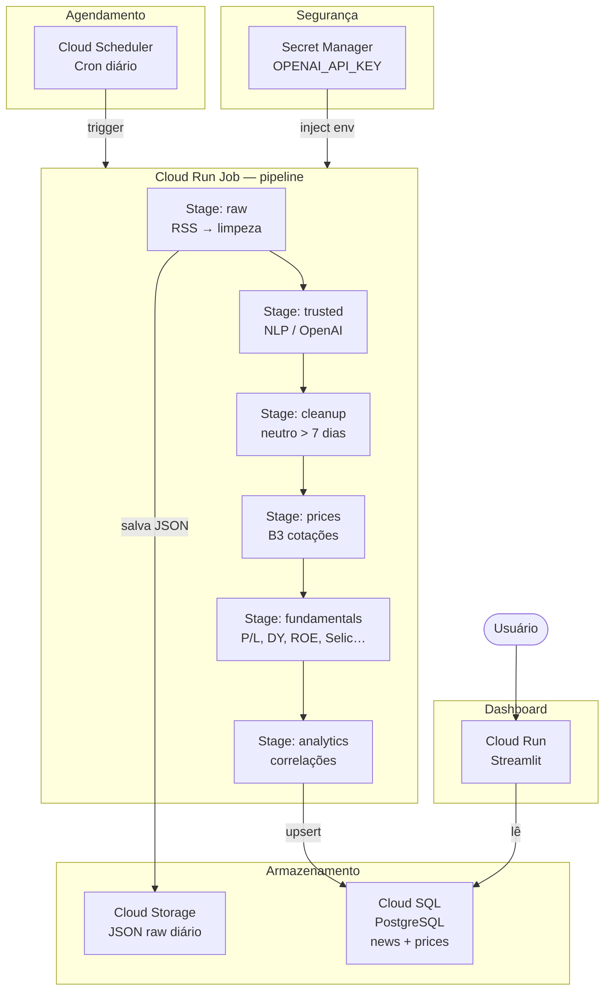

# B3 Market Feeling Detector

Pipeline de ingestão e análise de sentimento de notícias financeiras brasileiras, com dados históricos de preços da B3, indicadores fundamentalistas e dashboard interativo orientado por ativos.

---

## Funcionalidades

- **Ingestão** de notícias de RSS (InfoMoney, Valor Econômico, Exame)
- **Enriquecimento NLP** via OpenAI GPT-4o-mini: sentimento, relevância de mercado (0–1), tickers e segmentos
- **Limpeza automática** de notícias com sentimento neutro e mais de 7 dias
- **Preços históricos B3** desde 2025-01-01 (todos os ativos)
- **Indicadores fundamentalistas** (P/L, P/VPA, EV/EBITDA, ROE, Dividend Yield, etc.) via Fundamentus + yfinance — universo IBrX 100
- **Indicadores macroeconômicos** (Selic meta e IPCA 12m) via Banco Central
- **Correlações** notícia × variação de preço (D0, D+1, D+5)
- **Dashboard** com rank geral das ações por dados fundamentalistas, top 10 notícias mais relevantes, visão por ativo e feed completo de notícias

---

## Estrutura do Projeto

```
b3-market-feeling-detector/
├── src/
│   ├── ingestion/          # Busca RSS
│   ├── processing/         # Limpeza e normalização de texto
│   ├── nlp/                # Sentimento e enriquecimento (OpenAI)
│   ├── storage/            # SQLite + JSON raw
│   └── market_data/        # Preços B3, empresas, correlações, fundamentalistas
├── tests/                  # Suite de testes (pytest)
├── main.py                 # Orquestrador do pipeline
├── dashboard.py            # Dashboard Streamlit
├── Dockerfile              # Imagem Docker
├── docker-compose.yml      # Compose: pipeline (cron) + dashboard (Streamlit)
├── crontab                 # Agendamento cron diário (23:00 UTC)
├── entrypoint.sh           # Entrypoint do container de pipeline
├── .env.example            # Template de variáveis de ambiente
└── requirements.txt
```

---

## Instalação

```bash
pip install -r requirements.txt
cp .env.example .env   # preencha OPENAI_API_KEY
```

---

## Executando com Docker

O projeto inclui um `docker-compose.yml` com dois serviços que compartilham um volume persistente para o banco SQLite:

| Serviço | Função |
|---------|--------|
| `pipeline` | Executa `python main.py --stage all` todo dia às **23:00 UTC (20:00 BRT)** via cron |
| `dashboard` | Serve o dashboard Streamlit em `http://localhost:8501` |

### 1. Configure as variáveis de ambiente

```bash
cp .env.example .env
# Edite .env e preencha OPENAI_API_KEY
```

### 2. Suba os containers

> **⚠️ Sempre use `--build` na primeira execução** (ou após alterar o código).
> Sem essa flag o Docker Desktop tenta baixar a imagem de um registry e retorna erro 500.

```bash
docker compose up --build -d
```

- O `pipeline` ficará em execução contínua; o cron dispara o pipeline uma vez ao dia.
- O `dashboard` estará acessível em `http://localhost:8501`.

### 3. Acompanhe os logs

```bash
# Logs do pipeline (cron + execução diária)
docker compose logs -f pipeline

# Logs do dashboard
docker compose logs -f dashboard
```

### 4. Execute o pipeline manualmente (opcional)

Para forçar uma execução imediata sem aguardar o horário do cron:

```bash
docker compose exec pipeline python main.py --stage all
```

Ou para um estágio específico:

```bash
docker compose exec pipeline python main.py --stage raw
docker compose exec pipeline python main.py --stage prices
```

### 5. Expor o dashboard publicamente na web (ngrok)

O servidor Streamlit já escuta em `0.0.0.0:8501`, então qualquer máquina na mesma rede local
consegue acessar via `http://<ip-da-máquina>:8501`. Para expor na internet sem configurar
infraestrutura de nuvem, use o [ngrok](https://ngrok.com/):

```bash
# Instale o ngrok (https://ngrok.com/download) e autentique uma vez
ngrok config add-authtoken <seu-token>

# Com os containers já rodando, abra um túnel para a porta 8501
ngrok http 8501
```

O ngrok exibirá uma URL pública como `https://abcd1234.ngrok-free.app` — compartilhe esse
link para que outros acessem o dashboard de qualquer lugar.

> O link muda a cada vez que o ngrok é reiniciado. Para um endereço fixo, consulte os planos
> pagos do ngrok ou hospede em um serviço de nuvem (ver seção **Arquitetura GCP**).

### 6. Parar os containers

```bash
docker compose down
```

> O banco de dados fica no volume Docker `pipeline_data` e persiste entre reinicializações.
> Para apagar todos os dados use `docker compose down -v`.

---

## Variáveis de Ambiente

| Variável | Descrição |
|----------|-----------|
| `OPENAI_API_KEY` | Chave OpenAI (obrigatória para NLP) |
| `DB_PATH` | Caminho do banco SQLite (padrão: `data/news.db`) |

---

## Pipeline

```bash
# Backfill histórico de preços (executar uma vez)
python main.py --stage backfill --from 2025-01-01

# Execução diária completa
python main.py --stage all

# Estágios individuais
python main.py --stage raw          # busca notícias RSS
python main.py --stage trusted      # sentimento/NLP + relevância de mercado
python main.py --stage cleanup      # remove notícias neutras com > 7 dias
python main.py --stage prices       # preços do dia
python main.py --stage fundamentals # indicadores fundamentalistas (universo IBrX 100)
python main.py --stage fundamentals --tickers PETR4,VALE3  # tickers específicos
python main.py --stage analytics    # correlações
```

### Sequência completa do pipeline

```
raw → trusted → cleanup → prices → indicators → fundamentals → analytics
```

---

## Dashboard

```bash
streamlit run dashboard.py
```

Quatro abas:

| Aba | Conteúdo |
|-----|----------|
| **📊 Visão Geral** | KPIs agregados, rank geral das ações por dados fundamentalistas (ROE, DY, P/L, etc.) e top 10 notícias mais relevantes para o mercado |
| **📈 Por Ativo** | Selector de ticker, gráfico de preços (linha ou candlestick), indicadores fundamentalistas, notícias relacionadas, retornos D0/D+1/D+5 |
| **🧭 Indicadores** | Fear & Greed Index composto e indicadores brutos (TRIN, PCR, CDI, etc.) |
| **📰 Notícias** | Feed de notícias RSS com filtros de fonte, segmento, sentimento e período |

### Enriquecimento de Notícias

O estágio `trusted` enriquece cada notícia com os seguintes campos via OpenAI GPT-4o-mini:

| Campo | Tipo | Descrição |
|-------|------|-----------|
| `is_relevant` | bool | Se a notícia é financeiramente relevante |
| `market_relevance` | float 0–1 | Índice de relevância para o mercado financeiro brasileiro |
| `sentiment` | string | `positivo`, `negativo` ou `neutro` |
| `confidence` | float 0–1 | Confiança do sentimento atribuído |
| `segments` | list | Segmentos de mercado identificados |
| `tickers` | list | Tickers de ações brasileiras mencionados |

---

## Arquitetura GCP (execução diária)



### Componentes

| Componente | Serviço GCP | Papel |
|------------|-------------|-------|
| Agendamento diário | Cloud Scheduler | Aciona o job às 7h |
| Execução do pipeline | Cloud Run Job | Container `main.py --stage all` |
| Armazenamento raw | Cloud Storage | Snapshots JSON diários |
| Banco de dados | Cloud SQL (PostgreSQL) | Notícias, preços, correlações |
| Dashboard | Cloud Run (Streamlit) | Servido via HTTPS |
| Segredos | Secret Manager | `OPENAI_API_KEY`, conexão DB |
| Imagem Docker | Artifact Registry | Versões do container |

> Para migrar de SQLite para Cloud SQL, substitua a string de conexão em
> `src/storage/database.py` e `src/market_data/database_market.py` por uma
> URL PostgreSQL injetada via Secret Manager.

---

## Testes

```bash
pytest
```

---

## Licença

MIT — © 2025 JotaVMuniz
