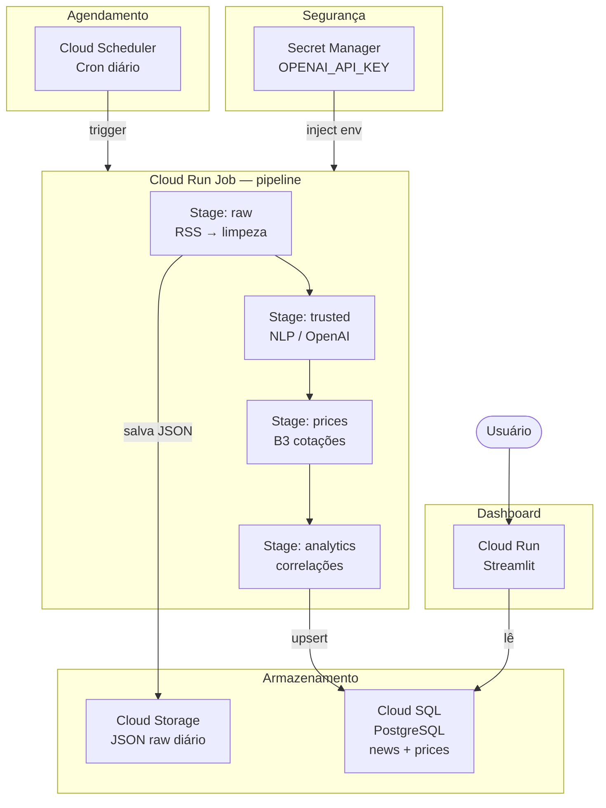

# B3 Market Feeling Detector

Pipeline de ingestão e análise de sentimento de notícias financeiras brasileiras, com dados históricos de preços da B3 e dashboard interativo orientado por ativos.

---

## Funcionalidades

- **Ingestão** de notícias de RSS (InfoMoney, Valor Econômico, Exame)
- **Enriquecimento NLP** via OpenAI GPT-4o-mini: sentimento, tickers, segmentos
- **Preços históricos B3** desde 2025-01-01 (todos os ativos)
- **Correlações** notícia × variação de preço (D0, D+1, D+5)
- **Dashboard** orientado por ativo com visão geral por segmento

---

## Estrutura do Projeto

```
b3-market-feeling-detector/
├── src/
│   ├── ingestion/          # Busca e deduplicação de RSS
│   ├── processing/         # Limpeza e normalização de texto
│   ├── nlp/                # Sentimento e enriquecimento (OpenAI)
│   ├── storage/            # SQLite + JSON raw
│   └── market_data/        # Preços B3, empresas, correlações
├── tests/                  # Suite de testes (pytest)
├── main.py                 # Orquestrador do pipeline
├── dashboard.py            # Dashboard Streamlit
├── Dockerfile              # Imagem para Cloud Run
└── requirements.txt
```

---

## Instalação

```bash
pip install -r requirements.txt
cp .env.example .env   # preencha OPENAI_API_KEY
```

---

## Pipeline

```bash
# Backfill histórico de preços (executar uma vez)
python main.py --stage backfill --from 2025-01-01

# Execução diária completa
python main.py --stage all

# Estágios individuais
python main.py --stage raw          # busca notícias
python main.py --stage trusted      # sentimento/NLP
python main.py --stage prices       # preços do dia
python main.py --stage analytics    # correlações
```

---

## Dashboard

```bash
streamlit run dashboard.py
```

Três abas:

| Aba | Conteúdo |
|-----|----------|
| **📊 Visão Geral** | Métricas agregadas por segmento, variação média de preço, heatmap sentimento × segmento |
| **📈 Por Ativo** | Selector de ticker, gráfico de preços (linha ou candlestick), notícias relacionadas, retornos D0/D+1/D+5 |
| **📰 Notícias** | Feed completo com filtros de fonte, segmento, sentimento e período |

---

## Arquitetura GCP (execução diária)



### Componentes

| Componente | Serviço GCP | Papel |
|------------|-------------|-------|
| Agendamento diário | Cloud Scheduler | Aciona o job às 7h |
| Execução do pipeline | Cloud Run Job | Container `main.py --stage all` |
| Armazenamento raw | Cloud Storage | Snapshots JSON diários |
| Banco de dados | Cloud SQL (PostgreSQL) | Notícias, preços, correlações |
| Dashboard | Cloud Run (Streamlit) | Servido via HTTPS |
| Segredos | Secret Manager | `OPENAI_API_KEY`, conexão DB |
| Imagem Docker | Artifact Registry | Versões do container |

> Para migrar de SQLite para Cloud SQL, substitua a string de conexão em
> `src/storage/database.py` e `src/market_data/database_market.py` por uma
> URL PostgreSQL injetada via Secret Manager.

---

## Variáveis de Ambiente

| Variável | Descrição |
|----------|-----------|
| `OPENAI_API_KEY` | Chave OpenAI (obrigatória para NLP) |
| `DB_PATH` | Caminho do banco SQLite (padrão: `data/news.db`) |

---

## Testes

```bash
pytest
```

---

## Licença

MIT — © 2025 JotaVMuniz
